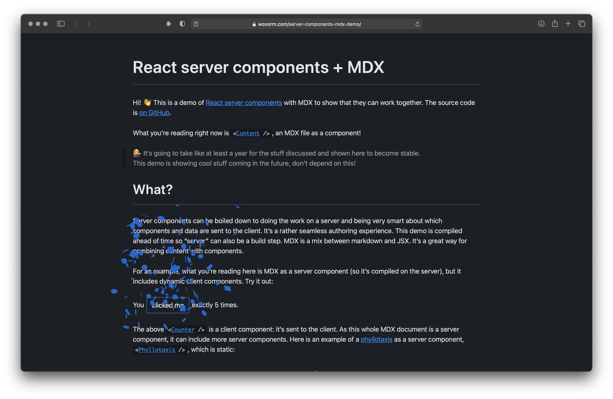

# server-components-mdx-demo

[](https://wooorm.com/server-components-mdx-demo/)

[Go to demo »](https://wooorm.com/server-components-mdx-demo/)

## Build

Clone this repo, `cd` into it, make sure you’re using Node 12+, and then:

```sh
npm i --legacy-peer-deps
npm run build
```

## Run

Then start an HTTP server in `build/`.

```sh
npx serve build/
```

## License

MIT
